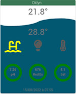

# Plugin Oklyn

Plugin qui permet de gerer votre piscine avec la solution Oklyn.

# Configuration du plugin
## Partie Configuration
Il faut récupérer la clé **API** directement sur l'application Mobile.

Se connecter sur le mobile dans le menu aller sur **Mon compte** ensuite **Accès API**.

Cette clé **API** la renseigner dans la configuration du plugin.
## Partie Panel

- Cocher **Afficher le panneau desktop** pour avoir l'historique de toutes
  les informations qui se trouvera dans **Accueil -> Oklyn**

# Configuration de l'équipement

Les valeurs à sélectionner obligatoirement :

- **Pack Oklyn :** sélectionner le pack que vous avez acheté au prêt d’Oklyn.
- **Auxilaire :** sélectionner l'auxilaire utiliser ou pas.
- **Auxilaire 2 :** sélectionner l'auxilaire 2 utiliser ou pas.

# Utilisation du widget Oklyn

Vous pouvez voir les historiques pour les informations en cliquant sur
une des information suivantes :
- Air
- Eau
- Ph
- RedOx
- Sel

Pour l'utilisation des **Auxilaires** en cliquant sur un des auxilaire
- Si grisé = non actif
- Si couleur = actif

Pour l'utilisation de la **Filtration** en cliquant dessus vous avez 3 choix
par défaut celui déjà en cours
- **Auto** = Jaune
- **On** = Vert
- **Off** = Rouge

Les données sont rafraîchies tout les 30 minutes.

